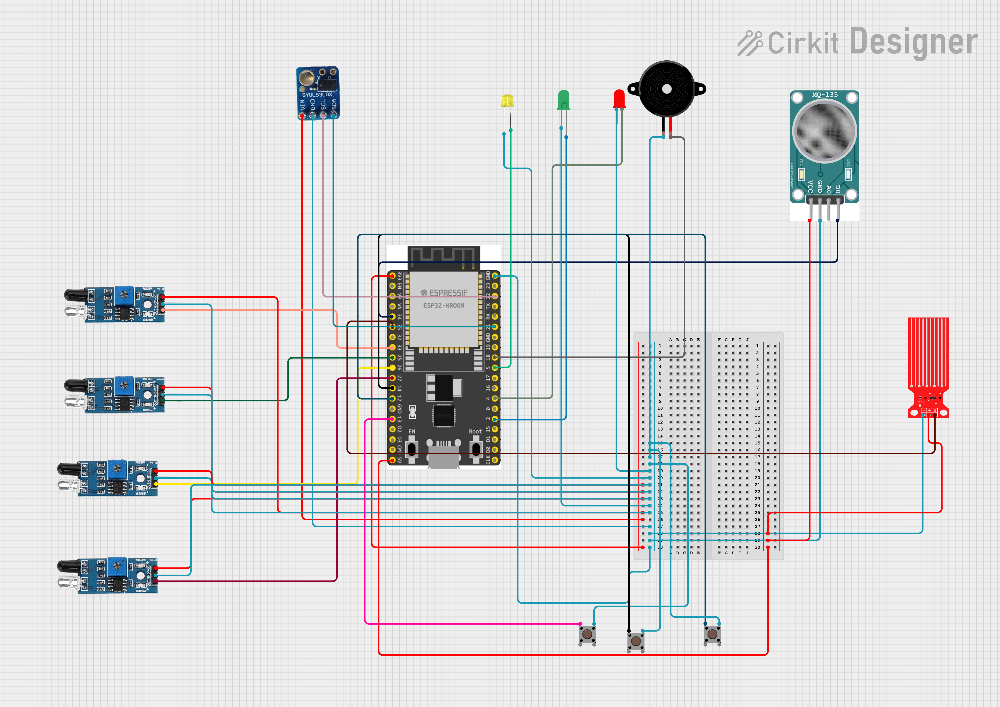
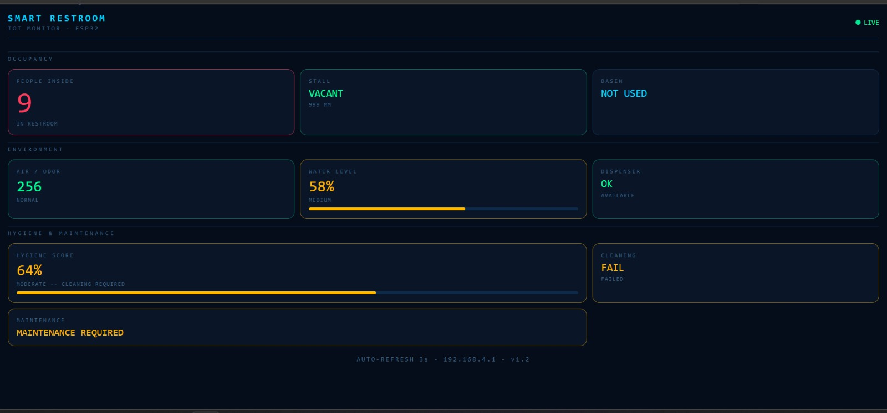

## SaniSense: Smart Restroom Ecosystem

## Problem  
Most restrooms are cleaned on a fixed schedule (e.g., every 3 hours), which is inefficient. This model doesn't account for heavy foot traffic or sudden hygiene drops. It leads to wasted resources when bathrooms are clean and poor conditions when they are busy.
 
## Solution 
We built SaniSense to move from "scheduled" cleaning to an on-demand model. Using an ESP32 and a suite of sensors, we track real-time usage and hygiene levels to trigger maintenance only when it's actually needed.

## Hardware Required

| Component | Purpose |
|---|---|
| ESP32-WROOM | Main controller |
| VL53L0X Sensor | Stall occupancy detection |
| MQ135 Gas Sensor | Air quality monitoring |
| IR Sensor 1 | Entry detection |
| IR Sensor 2 | Exit detection |
| IR Sensor 3 | Basin approach detection |
| IR Sensor 4 | Dispenser stock detection |
| Water Sensor | Cleaning verification |
| Active Buzzer | Alerts (SOS, cleaning, restock) |
| Green LED | Vacant indicator |
| Red LED | Occupied indicator |
| Yellow LED | Warning indicator |
| SOS Button | Emergency alert |
| Cleaning Button | Trigger cleaning mode |
| Maintenance Button | Trigger maintenance mode |

## Software Required

| Software | Purpose |
|---|---|
| Thonny IDE | Upload and run MicroPython code |
| MicroPython Firmware | Run Python on ESP32 |

## Installation Steps
1. Flash MicroPython to ESP32
2. Install required libraries
3. Upload `main.py` and `vl53l0x.py`
4. Connect sensors as per circuit diagram
5. Power ON ESP32
6. Connect to WiFi AP:
   SSID: SmartRestroom
   Password: 12345678
7. Open browser:
   `192.168.4.1`

## Run
The dashboard starts automatically after boot.

## Circuit Diagram 

## Technical Breakdown 
1. Precise Occupancy (VL53L0X ToF)
Instead of standard PIR motion sensors—which fail if a person remains stationary—we used the VL53L0X Time-of-Flight (ToF) sensor. It uses laser ranging to measure exact distance, providing a 100% privacy-compliant way to detect if a stall is occupied.
2. Traffic Tracking (Dual IR Array)
We implemented a dual IR sensor setup at the entrance. By coding a specific trigger sequence, the system detects the direction of movement (entry vs. exit) to maintain a live "People Inside" count.
3. Hygiene Analytics (MQ135 & Algorithm)
We used an MQ135 sensor to monitor odor and air quality. The team developed a weighted algorithm that calculates a Hygiene Score. If odors are high or foot traffic exceeds a set limit, the system automatically flags the room for cleaning.
4. The Verification Loop (Water Sensor)
To ensure staff accountability, we added a Water Level Sensor. When the "Clean" button is pressed, the system captures a moisture baseline. The Hygiene Score only resets if the sensor detects actual water usage, proving that cleaning took place.

##  Demo Video
[Watch Demo Video](https://drive.google.com/file/d/1qPsSYXlXrMULDD0MsDplftLNKpUN2_ml/view?usp=drivesdk)

## Dashboard 

The team developed a custom web interface hosted directly on the ESP32. It is a mobile-responsive dashboard with a 1-second refresh rate for:
1. Occupancy Status: Stalls and Basins.
2. Environmental Health: Live Odor/Air Quality readings.
3. Inventory Alerts: Soap and Dispenser levels.
4. Notifications: Emergency SOS and Maintenance requests.
